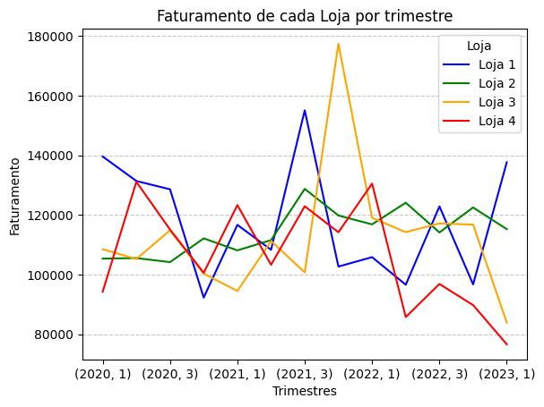
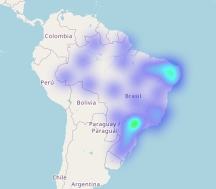
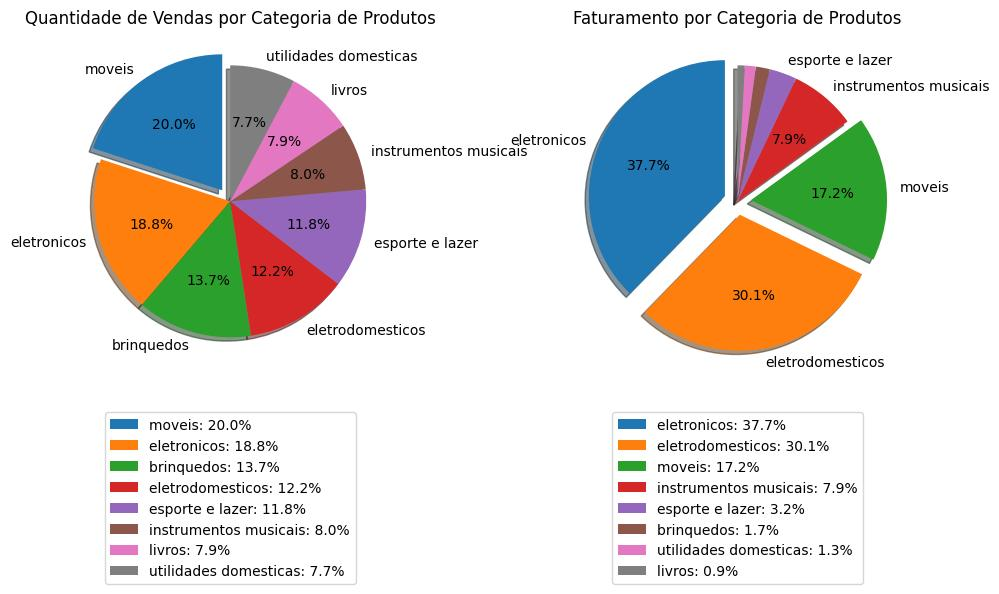

<h1> CHALLENGE: ONE Data Science - Alura Store | Trello </h1>

  
  
  
  
  
  

<h2>Resumo do projeto</h2>

Projeto realizado para atender o Challenge do curso ONE Data Science G8

Realizado na Alura, visando o desenvolvimento das habilidades em análise de dados com Python.

<h2>❔ Objetivo</h2>
O objetivo desse projeto é analisar os dados disponíveis das 4 lojas fictícias do Sr. João, para auxiliar na decisão sobre qual loja vender para levantar fundos para investir em um novo negócio.

<h2>📸 Alguns gráficos disponíbilizados na análise:</h2>

- Faturamento trimestral por loja:

- Mapa de Vendas por localidade:

- Vendas por categoria de produto:

<h2>🔨 ## Metodologia</h2>

Os dados foram disponibilizados em 4 arquivos CSV, correspondentes à cada loja, com os seguintes campos:
- Produto 	
- Categoria do Produto 
- Preço 
- Frete 
-	Data da Compra 
- Vendedor 
-	Local da compra 
-	Avaliação da compra 
-	Tipo de pagamento 
-	Quantidade de parcelas 
-	lat 
-	lon

Carreguei cada arquivo em um dataset Pandas separado e verifiquei a existência dos mesmos campos e tipos de dados. Como os dados estavam consistêntes, criei uma coluna adicional 'Loja' em cada dataset e uni os quatro em um único dataset chamado 'Lojas'.
Criei series de dados agrupando os dados pelos campos a serem analisados, somando ou contando os valores e preparando gráficos com MatPlotLib.
Criei um mapa interativo com Folium utilizando as informações geográficas disponíveis.

<h2>✔️ Técnicas e tecnologias utilizadas</h2>

   - Para realizar a análise, foi utilizado o ambiente do Google Colab, com a linguagem Python e as bibliotecas Pandas, Matplotlib, Folium entre outras. 

<h2>📁 Acesso ao projeto</h2>

   - Você pode acessar o projeto no Colab clicando [aqui](https://colab.research.google.com/drive/1RY37fQDHHL0mn87SUq85KhkbBPaNdmaa?usp=sharing)

<h2> Autor </h2>

[  Mauricio Andre de Almeida](https://github.com/mauricioaalmeida) 
